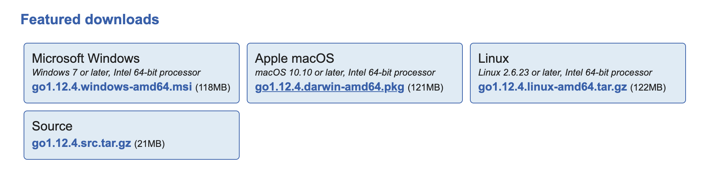

# 搭建Go开发环境

## 1.下载Go语言安装文件

**访问Go语言官方网站下载页面:** 

https://golang.org/dl

可以看到官网提供了Microsoft Windows、Apple MacOS、Linux和Source下载。

选择下载你所使用的操作系统的二进制安装包下载（本文只介绍二进制包安装方式，如果你熟悉你所使用的操作系统源码安装方式，也可以下载源码包安装）



## 2.根据你所使用的操作系统提示安装

通过二进制包安装是比较简单的，按照安装包提示流程一步一步进行即可。

## 3.配置环境变量

**在正式使用Go编写代码之前，有一个重要的环境变量需要配置，他就是 “$GOPATH”**

> GOPATH环境变量指定工作区的位置。如果没有设置GOPATH，则假定在Unix系统上为`$HOME/go`，在Windows上为 `%USERPROFILE%\go`。如果要将自定义位置用作工作空间，可以设置GOPATH环境变量。

GOPATH环境变量是Go安装包、下载源码以及依赖包所在的的必要路径，Go1.11后，包管理虽然可以不再依赖 `$GOPATH/src`，但是依然需要使用 `$GOPATH/pkg` 路径来保存依赖包。

首先创建好一个目录用作GOPATH目录

**Linux & MacOS:**

----

`$ export GOPATH=$YOUR_PATH/go`

永久保存环境变量

`$ source ~/.bash_profile`

**Windows:**

----

`控制面板->系统->高级系统设置->高级->环境变量设置`

$GOPATH设置好后，它是一个空目录，当在开发工作中执行go get、go install命令后， $GOPATH所指定的目录会生成3个子目录：

- bin：存放 `go install` 编译的可执行二进制文件
- pkg：存放 `go install` 编译后的包文件，就会存放在这里
- src：存放 `go get` 命令下载的源码包文件

## 4.检查环境

打开命令行工具，运行

`$ go env`

如果你看到类似这样的结果，说明Go语言环境安装完成.

``` shell

GOARCH="amd64"
GOBIN=""
GOCACHE="/Users/zeta/Library/Caches/go-build"
GOEXE=""
GOFLAGS=""
GOHOSTARCH="amd64"
GOHOSTOS="darwin"
GOOS="darwin"
GOPATH="/Users/zeta/workspace/go"
GOPROXY="https://goproxy.io"
GORACE=""
GOROOT="/usr/local/go"
GOTMPDIR=""
GOTOOLDIR="/usr/local/go/pkg/tool/darwin_amd64"
GCCGO="gccgo"
CC="clang"
CXX="clang++"
CGO_ENABLED="1"
GOMOD=""
CGO_CFLAGS="-g -O2"
CGO_CPPFLAGS=""
CGO_CXXFLAGS="-g -O2"
CGO_FFLAGS="-g -O2"
CGO_LDFLAGS="-g -O2"
PKG_CONFIG="pkg-config"
GOGCCFLAGS="-fPIC -m64 -pthread -fno-caret-diagnostics -Qunused-arguments -fmessage-length=0 -fdebug-prefix-map=/var/folders/7v/omg2000000000000019/T/go-build760324613=/tmp/go-build -gno-record-gcc-switches -fno-common"
```

## 5.选择一款趁手的编辑器或IDE

现在很多通用的编辑器或IDE都支持Go语言比如

- [Atom](https://atom.io/)
- [Visual Studio Code](https://code.visualstudio.com/)
- [Sublime Text2](https://www.sublimetext.com/2)
- [ItelliJ Idea](https://www.jetbrains.com/idea/)

专用的IDE有

- [LiteIDE](http://liteide.org/cn/)
- [Goland](https://www.jetbrains.com/go/?fromMenu)

专用的IDE无论是配置和使用都比通用编辑器/IDE的简单许多，但是我还是推荐大家使用通用编辑器/IDE，因为在开发过程中肯定会遇到其他语言的查看和编写，专用IDE在其他语言编写方面较弱，来回切换编辑器/IDE窗口会不方便。

其次，专用编辑器提供很多高效的工具，在编译、调试方面都很方便，但是学习阶段，建议大家手工执行命令编译、调试，有利于掌握Go语言。

### 下一节，开始我们的第一个Go程序，Hello World